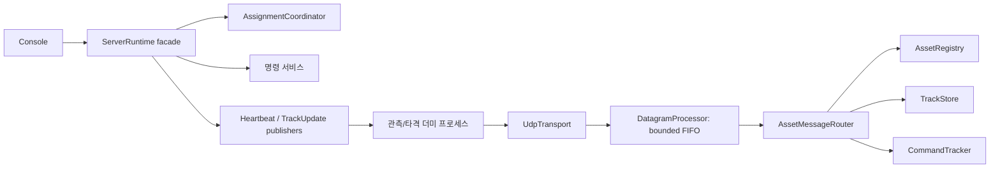

# C2 통제소 서버: 포트폴리오 안내

이 프로젝트는 여러 관측·타격 자산의 등록, 상태, 표적과 명령 결과를 관리하는
Windows C++20 UDP 서버다. 실제 장비 대신 별도 프로세스의 더미 자산으로
통신 계약과 장애 시 상태전이를 검증한다.

## 먼저 확인할 근거

| 역량 | 구현과 확인 방법 |
|---|---|
| 네트워크 서버 | 실제 source Endpoint 기반 등록·세션 검증, UDP loopback·다중 프로세스 smoke |
| 신뢰성 | delivery/completion ACK 구분, 재전송, 만료, 세션 교체 시 pending 종료 |
| 동시성·자원 관리 | 객체별 잠금, RAII 소켓/스레드, 용량 제한 FIFO와 drain 후 종료 |
| 운영성 | metrics에서 수신/송신 오류, 큐 깊이·바이트·high-water·drop·대기시간 관찰 |
| 설계 | Runtime facade, 생성자/callback 주입, 상태 캡슐화, ADR로 선택과 trade-off 기록 |
| 검증 | 상태 격리·경합·과부하·consumer 예외 테스트, 실제 프로세스 smoke, CI 결과 artifact |
| 측정 | 재현 가능한 encode + 인증 + 트랙 저장 microbenchmark, percentile과 환경 JSON |

원하는 순서로 읽기: [설계 사례](case-study.md) → [운영 절차](../operations.md) →
[측정 재현](benchmark.md) → [설계 결정 목록](../decisions/ADR-009-runtime-command-responsibilities.md).

## 아키텍처

공용 UDP 포트는 단일 FIFO worker로 처리한다. 콘솔, 주기 worker와 호환 포트는 별도
호출 경로여서 객체별 잠금과 자산 수명주기 조율이 여전히 필요하다.

## 5분 데모

1. 저장소 README의 Release 빌드와 전체 테스트를 실행한다.
2. `scripts/run_udp_smoke.ps1 -BinDir ./build/Release`로 관측 2대와 타격 3대의
   등록, 표적 분리, 지향·공격·비상정지와 session 교체를 보여준다.
3. 대화형 실행은 `scripts/run_dummy_clients_visible.cmd`를 사용한다.
   서버의 `assets`, `targets`, `metrics`, `outcomes`, `events`로 상태를 확인한다.
4. 테스트의 `DatagramProcessorTest`로 처리 worker를 의도적으로 막아 포화와
   drop을 재현하고, 해제 후 FIFO 순서와 drain 완료를 검증한다.
5. benchmark를 실행하고 workload/환경/범위를 설명한 뒤 p50/p95/p99를 읽는다.

면접에서는 기능 수보다 실패 조건을 설명한다: ACK가 늦으면 어떤 상태가 바뀌는가,
자산이 같은 ID로 재시작하면 이전 명령은 어떻게 처리하는가, 큐가 차면 무엇을 버리고
어떤 지표로 알아차리는가, 종료 시 worker가 사용하는 객체는 언제 파괴되는가.

## 책임 있게 설명할 범위

실제 LiDAR/모터/출력 하드웨어, 암호학적 자산 인증, 시간 동기화, 승인 권한,
실장비 지향 오차와 현장 안전성은 완료 항목에 포함하지 않는다.
Endpoint/session 일치는 암호학적 인증을 대신하지 않는다. microbenchmark는
UDP end-to-end 처리량이나 실제 제어 지연을 보장하지 않는다.
개인 기여는 실제 커밋과 구현 내용을 기준으로 설명하고 팀 작업 전체를 단독 성과로
표현하지 않는다. 수치를 인용할 때 측정 파일과 실행 환경을 함께 제시한다.
